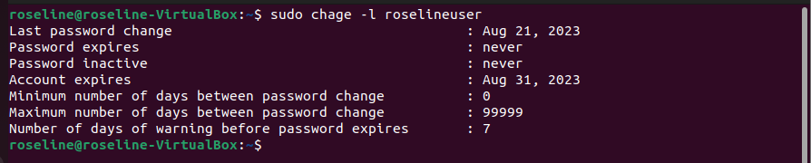

## Task
This is step-by-step process of how to create a user, add user to a group, and grant certain permissions. This is in fulfillment to a task given by my instructor at AltSchool Africa for the Cloud Engineering Program. 

Before I begin, I've already installed the following:
- Virtualbox
- Ubuntu 0S 

### Create a user
Run the following command on your Ubuntu terminal:

```sudo adduser YOUR-USERNAME```

Output:


### set an expiry date of two weeks for the user
The way to set an expiry date for a user is by running 

``` sudo chage -E yyyy-mm-dd YOUR-USERNANE```

Output:


### Verify that the expiry date has been set
To verify the expity date, run: 

```sudo chage -l YOUR-USERNAME```

You should have a similar output as this:


### Prompt the user to change password on login


### Attach the user to a group called "altschool"


### Allow altschool group to be able to run only `cat` command on /etc/


### Create another user. make sure that this user doesn't have a home directory.


### Verify
